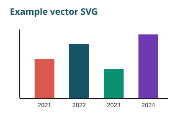

==============
Image examples
==============

Raster images (PNG, JPEG) and vector images (SVG) both embed with the standard reStructuredText :code:`image` and :code:`figure` directives, and both render in the HTML site and the downloadable PDF.

SVG
---

SVG is a good choice for diagrams and charts, because it stays sharp at any size. The theme converts SVGs to PDF automatically during the PDF build (see :doc:`../pdf-styling`), so the same SVG works in both HTML and PDF - there's no need to keep a separate PNG copy.

.. code-block:: rst

    .. image:: ../_static/svg-example.svg
       :alt: Bar chart drawn as a vector SVG in the IATI brand colours
       :width: 360

